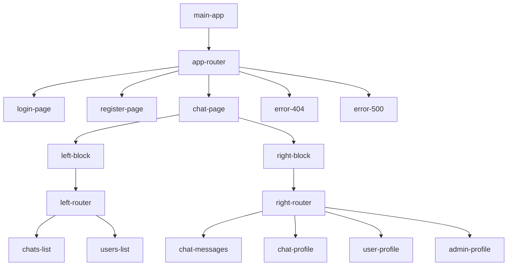

[](https://app.netlify.com/sites/andreys/deploys)

# CHAT

#### Сервис обмена текстовыми сообщениями в сети в режиме реального времени. Данное веб-приложение позволяет неограниченному числу пользователей одновременно общаться между собой.

#### Проектная работа выполняется в рамках курса "Миддл-фронтенд Разработчик" от Яндекс Практикума

Доступно на [Netlify](https://andreys.netlify.app/)

<a href="https://andreys.netlify.app/" target="_blank" rel="noopener noreferrer">
 
</a>

## Текущий этап

### Спринт 1 / 4 [(PR)](https://github.com/mrNote23/middle.messenger.praktikum.yandex/pull/2)

- Верстка в соответствии с [макетом](https://ibb.co/x7V8WN7)
- Полностью работает навигация по страницам и разделам

### Спринт 2 / 4 [(PR)](https://github.com/mrNote23/middle.messenger.praktikum.yandex/pull/3)

- Подключен TypeScript
- Добавлены компоненты
- Организован стейт-менеджмент
- Реализована валидация всех форм
- Добавлены ESLint, StyleLint
- Добавлен класс для работы с HTTP запросами

## СТЭК

- HTML
- Typescript
- Javascript
- Handlebars
- Parcel
- SASS
- PostCSS
- ESLint
- StyleLint

# Структура приложения

```typescript
// Менеджер состояний
class State {
  store(varName: string, val: any): boolean {
    // сохранение объекта без оповещения подписчиков
  };

  dispatch(varName: string, val: T): void {
    // изменение объекта с оповещением подписчиков
  };

  extract(varName: string): any {
    // получение объекта
  };

  subscribe(varName: string, cb: object): TSubscriberItem {
    // подписка на изменение объекта
  };

  unsubscribe(subs: TSubscriberItem): void {
    // отписка от подписки :)	  
  };

  clear(): void {
    // полная очистка, удаление всех объектов и подписчиков
  };
}

// Управление приложением
class AppChat {
  init() {
    // Инициализация приложения
  }

  start() {
    // Старт
  }

  navigate() {
    // Навигация по страницам
  }

  login() {
    // Логин пользователя
  }

  logout() {
    // Выход из приложения
  }

  // и т.д. 
  // ...
}
```

### DOM Components



# Создание компонент

### **`Class Component()`**

> Шаблон компонента (precompiled hbs) передается в методе **super()** при создании экземпляра класса,
> либо позже в **this.view**

- `render({props})`

  рендер компонента с параметрами props для шаблона handlebars
- `connected(): void`

  метод вызывается после монтирования компонента в DOM
- `disconnected(): void`

  метод вызывается перед демонтирования компонента из DOM
- `setter subscriber:TSubscriber`

  записывает подписчика State.subscriber в стэк
- `setter listener:TListener`

  записывает слушателя событий в стэк
- `getProps():Promise`

  получение пропсов компонента прописанных в атрибуте props-data
- `createEvent(eventName: string, eventProps: any): void`

  создание события с названием eventName, обработчики события указываются в атрибуте event-eventName или через
  addEventListener

> После демонтирования компонента из DOM, все подписчики и слушатели установленные через **subscriber** и **listener** -
> удаляются

Пример использования:

```typescript
// MainComponent.ts
import view from "./MainComponent.hbs"
import {Component} from "./Component";

export class MainComponent extends Component {
  props: {
    title: string;
    counter: number;
  };

  constructor() {
    super(view);
  }

  onInput = (e) => {
    this.getElementsByTagName("h1")[0].textContent = e.target.value;
  };

  onClick = () => {
    this.props.counter = 0;
    State.dispatch("counter", this.props.counter);
  };

  showCounter = (val) => {
    this.getElementsByTagName("h2")[0].textContent = val;
  };

  connected(): void {
    this.getProps.then((props: any) => {
      this.props = props;
      this.render({...this.props});

      State.store("counter", this.props.counter);
      this.subscriber = State.subscribe("counter", this.showCounter);

      setInterval(() => {
        this.props.counter++;
        State.dispatch("counter", this.props.counter);
      }, 1000);
    });
  }
}

```

```HTML
<!--MainComponent.hbs-->
<h1>{{title}}</h1>
<h2>{{counter}}</h2>
<input type="text" name="title" event-input="[[onInput]]" value="{{title}}">
<button event-click="[[onClick]]">Reset counter</button>
```

# Описание некоторых компонент

## RouterComponent

Динамическое изменение контента в зависимости от атрибута path

пример использования

```typescript
// App.ts
import view from "./App.hbs";
import {Component} from "./Component";
import {RouterComponent} from "./RouterComponent";

window.customElements.define("main-router", RouterComponent);

type TRoute = {
  path: string;
  content?: string;
  redirect?: string;
};

export class App extends Component {
  routRoutes: TRoute[] = [
    {
      path: "/",
      content: "<chat-page></chat-page>",
    },
    {
      path: "/login",
      content: "<login-page></login-page>",
    },
    {
      path: "/register",
      content: "<register-page></register-page>",
    },
    {
      path: "/404",
      content: "<error-page>404</error-page>",
    },
    {
      path: "/500",
      content: "<error-page>500</error-page>",
    },
    {
      path: "*",
      redirect: `/404`,
    },
  ];

  constructor() {
    super(view({path: "/"}));
  }

  connected() {
    this.render();
  }
}
```

```HTML
<!-- App.hbs-->
<main-router path="{{path}}" props-data="[[routRoutes]]"></main-router>
```

## FormValidatorComponent

Валидация форм

Пример использования

```typescript
// Login.ts
import view from "./Login.hbs";
import {Component} from "./Component";
import {FormValidator} from "./FormValidator";

window.customElements.define("form-validator", FormValidator);

enum MATCH {
  PHONE = "phone", // телефон в формате +78217348374, '+' - не обязателен
  EMAIL = "email", // стандартный email
  PASSWORD = "password", // символы в разных регистрах и цифры
}

type TFormValidatorConfig = {
  [key: string]: {
    required?: boolean; // true - обязательное поле
    firstUC?: boolean; // true - первая буква станет заглавной
    minLength?: number; // минимальная длина
    maxLength?: number; // максимальная длина (автоматическая обрезка)
    match?: MATCH; // тип поля для валидации
    message?: string; // сообщение при неверном вводе
    compare?: string; // имя поля для сравнения (например для подтверждения пароля)
    filter?: unknown; // регулярное выражение, удалится все, что описано
  };
};

export class Login extends Component {
  formFields: TFormValidatorConfig = {
    login: {
      required: true,
      minLength: 3,
      maxLength: 20,
      filter: /[^а-яa-z0-9-]+/gi,
      message: "3 to 20 characters, letters, numbers, '-'",
    },
    password: {
      required: true,
      minLength: 8,
      maxLength: 40,
      message: "8 to 40 characters",
    },
  };

  constructor() {
    super(view);
  }

  // результат возвращается в e.detail
  // при событии формы 'submit' возвращаются данные формы
  // при событии 'reset' возвращается false
  formValidated = (e: CustomEvent): void => {
    console.log(`You are logined: ${e.detail}`);
  };

  connected(): void {
    this.render();
  }
}
```

```HTML
<!--Login.hbs-->
<form-validator props-fields="[[formFields]]" event-validated="[[formValidated]]">
  <form novalidate>
    <input type="text" name="login" id="login">
    <label for="login">Login</label>
    <input type="password" name="password" id="password">
    <label for="password">Password</label>
    <button type="submit">Sign in</button>
  </form>
</form-validator>
```

## ModalWindowComponent

Модальное окно

Пример использования

> При вызове RenameChat() будет открыто модальное окно с формой для редактирования названия чата

```typescript
// RenameChat.ts
import view from "./RenameChat.hbs";
import {ModalWindow} from "./ModalWindow";
import {TFormValidatorConfig} from "./FormValidator";

export const RenameChat = (): void => {
  const formFields: TFormValidatorConfig = {
    chat_name: {
      required: true,
      minLength: 10,
      maxLength: 50,
      filter: /[^а-яa-z0-9\-\s]+/gi,
      message: "10 to 50 characters, letters, numbers, '-'",
    },
  };

  const modalWindow = new ModalWindow(
    "Rename chat", // Title для модального окна
    view({chatTitle: "current chat name"}), // InnerHTML для модального окна
    {
      // дополнительные пропсы для ModalWindowComponent
      formFields, // В текущем примере передаются данные для формы
      formValidated,
    }
  );

  // обработчик формы из модального окна
  function formValidated(e: CustomEvent): void {
    console.log(e.detail);
    modalWindow.remove();
  }
};
```

```HTML
<!--RenameChat.hbs-->
<form-validator props-fields="[[formFields]]" event-validated="[[formValidated]]">
  <form novalidate>
    <div>
      <input
        type="text"
        name="chat_name"
        id="chat_name"
        value="{{chatTitle}}"
      />
      <label for="chat_name">Chat name</label>
    </div>

    <div>
      <button type="submit">Rename</button>
      <button type="reset">Not now</button>
    </div>
  </form>
</form-validator>
```

# Установка и запуск приложения

### Установка пакета

```text
git clone https://github.com/mrNote23/middle.messenger.praktikum.yandex.git chat-app
```

```text
cd chat-app
```

### Установка зависимостей

```text
npm install
```

### Сборка проекта (Parcel)

```text
npm run build
```

### Запуск на http://localhost:3000

```text
npm start
```

### Проверки ESLint, StyleLint

```text
npm run lint:eslint
npm run lint:stylelint
```
